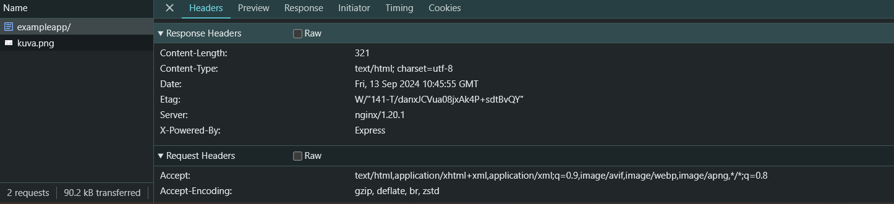
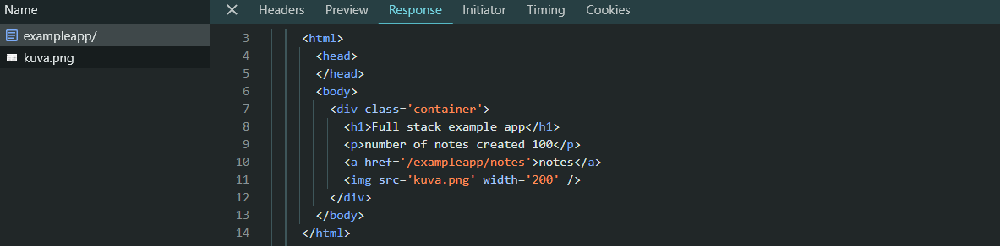
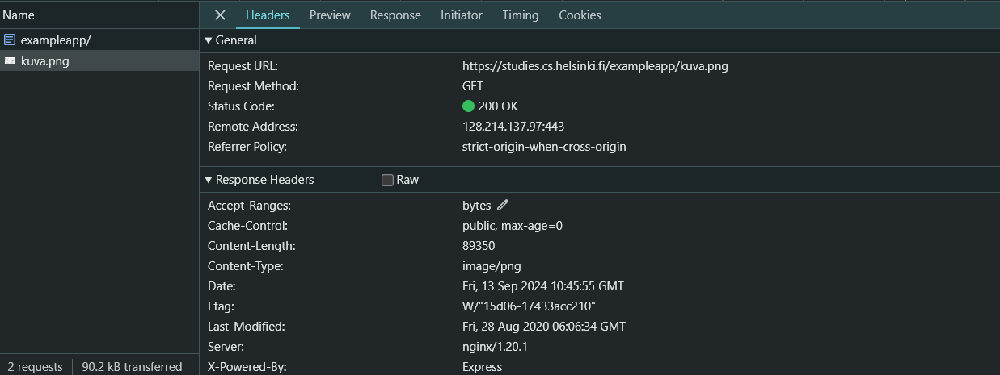
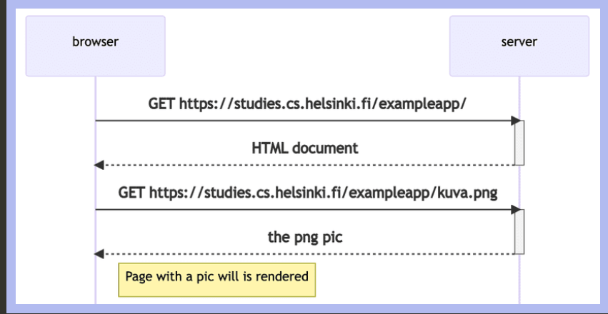

# Fundamentals of Web apps

We will go through some principles of web development by examining an [example application](https://studies.cs.helsinki.fi/exampleapp/_)

<strong>The 1st rule of web development:</strong> Always keep the Developer console open on your web browser.

We will first look at Network tab, check Diable cache option.

Preserve log (saves the logs printed by the application when the page is reloaded)

Hide extension URLs (hides requests of any extensions installed in the browser)

## HTTP GET

The server and the web browser communicate with each other using the [HTTP](https://developer.mozilla.org/en-US/docs/Web/HTTP) protocol. The network tab shows how the browser and the server communicate.

When we reload the page the console will show that two eventa have happened.

- The browser has fetched the contents of the page studies.cs.helsinki.fi/exampleapp from the server
- And has downloded the image kuva.png.
  

Clicking the first event reveals more information:

The General part of the headers shows taht the browser requested the address https://studies.cs.helsinki.fi/exampleapp/ using the [GET](https://developer.mozilla.org/en-US/docs/Web/HTTP/Methods/GET) method, and the request was successful, because the server response has the [Status code](https://en.wikipedia.org/wiki/List_of_HTTP_status_codes) 200.

The request and the server response have several [headers](https://en.wikipedia.org/wiki/List_of_HTTP_header_fields):

As shown in the above image the Response headers on top tell us eg. the size fo the response in bytes adn the exact time of the response. An important header Content-type tells us that the response is a text file in utf-8 format and the contents of which have been formatted with HTML. This way the browser knows the response to be a regular HTML page and render it to the browser 'like a web page'.

The Response tab shows the response data, a regular HTML page. The body section determines the structure of the page rendered to the screen:

The page contains a div element, which contains a heading, a link to the page notes, and an img tag, and displays the number of notes created.

Because of the img tag, the browser does a second HTTP request to fetch the image kuva.png from the serve:

The request was made to the address https://studies.cs.helsinki.fi/exampleapp/kuva.png and its type is HTTP GET. The response headers tell us that the response size is 89350 bytes, and its Content-type is image/png, so it is a png image. The browser uses this information to render the image correctly to the screen.

The chain of events caused by opening the page on a browser forms this sequence diagram:

This seqeunce diagram visualizes how the browser and server communicates over the time.

First, the browser sends an HTTP GET request to the server to fetch the HTML code of the page. The img tag in the HTML prompts the browser to fetch the image kuva.png. The browser renders the HTML page and the image to the screen.

Its difficult to notice but the HTML page will render before the image has been fetched from the server.
