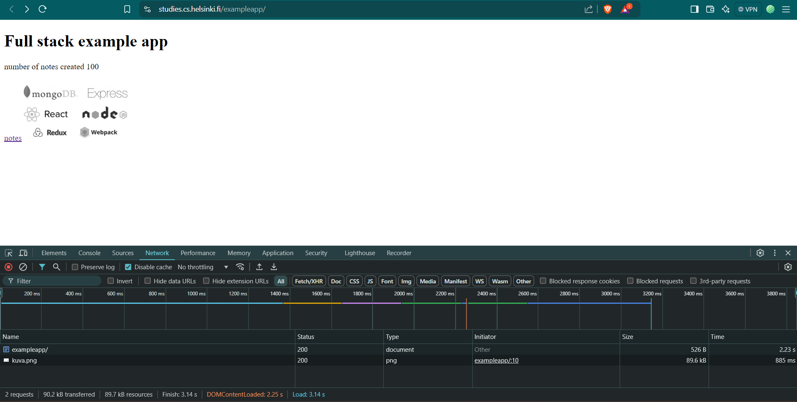
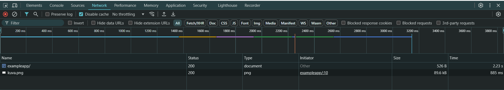
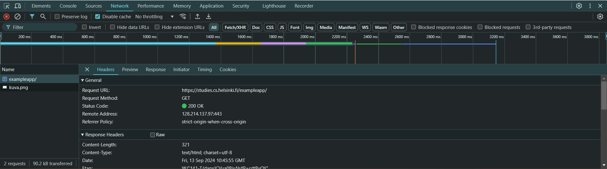

# Fundamentals of Web apps

We will go through some principles of web development by examining an [example application](https://studies.cs.helsinki.fi/exampleapp/_)

<strong>The 1st rule of web development:</strong> Always keep the Developer console open on your web browser.

We will first look at Network tab, check Diable cache option.

Preserve log (saves the logs printed by the application when the page is reloaded)

Hide extension URLs (hides requests of any extensions installed in the browser)

## HTTP GET

The server and the web browser communicate with each other using the [HTTP](https://developer.mozilla.org/en-US/docs/Web/HTTP) protocol. The network tab shows how the browser and the server communicate.

When we reload the page the console will show that two eventa have happened.

- The browser has fetched the contents of the page studies.cs.helsinki.fi/exampleapp from the server
- And has downloded the image kuva.png.
  

Clicking the first event reveals more information:

